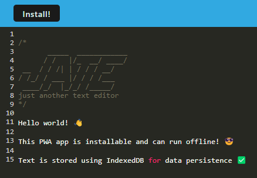

# Text-Editor
## Overview

This project is a Progressive Web Application (PWA) text editor that enables users to create and store notes or code snippets, with or without an internet connection. The application is built to meet PWA criteria, featuring offline functionality and data persistence using IndexedDB.
- Offline Functionality: Users can create, edit, and retrieve notes or code snippets even without an internet connection
- IndexedDB Storage: Utilizes IndexedDB to store and retrieve content, ensuring data persistence
- Service Worker: Incorporates a service worker using Workbox to enable offline caching of static assets

## API Endpoints Visualization
Here is a visualization of the text editor running in the browser!

## Deployment
See it live at: https://pacific-waters-02803-fe3b2d52492d.herokuapp.com/
